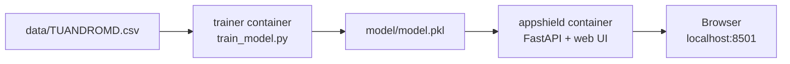

# APPSHIELD — Android Privacy & Malware Risk Analyzer

APPSHIELD estimates the malware risk of an Android app from the permissions and
API calls it uses. A Random Forest model trained on the TUANDROMD dataset scores
the app, and the interface shows the verdict together with the indicators that
influenced it.

> **Educational prototype, not an antivirus.** It gives a statistical estimate
> from permission and API-call patterns. It cannot prove an app is safe.

## Features

- **Single App** — select an app's permissions and API calls and get a risk assessment: verdict, confidence, malware probability and the contributing indicators.
- **Batch** — upload a CSV of many apps and get a risk-sorted table, with filters by risk level. If the file has a `Label` column, the model's agreement with it is reported.
- **Model Insights** — the features the model relies on most, and the balance of the training data.

## Tech stack

| Layer | Technology |
|---|---|
| Model | scikit-learn Random Forest (200 trees, 241 features) |
| Backend | Python, FastAPI, Uvicorn |
| Frontend | Single-page HTML, CSS and JavaScript (no build step) |
| Packaging | Docker and Docker Compose |

## Quick start (Docker, recommended)

**Prerequisites:** [Docker Desktop](https://www.docker.com/products/docker-desktop/), installed and running.

```bash
git clone https://github.com/lambdadesrushti/appshield.git
cd appshield
docker compose up --build
```

1. The first run takes a few minutes while it installs packages.
2. A `trainer` service retrains the model on `data/TUANDROMD.csv` and saves `model/model.pkl`. It prints the test accuracy and exits.
3. The `appshield` service then starts. Wait for `Uvicorn running on http://0.0.0.0:8501`.
4. Open **http://localhost:8501** in your browser. Do not use `0.0.0.0:8501`; browsers cannot open that address.
5. The top right of the page should say **Engine online**.

Stop the app with `Ctrl+C`, then remove the containers with `docker compose down`.

**Skip retraining** (the repository already includes a trained model):

```bash
docker build -t appshield .
docker run -p 8501:8501 appshield
```

## Run without Docker

Requires Python 3.10 or newer.

```bash
pip install -r requirements.txt
python train_model.py          # optional: retrains and overwrites model/model.pkl
uvicorn server:app --port 8501
```

Then open **http://localhost:8501**.

## Using the app

**Single App.** Click *Goodware sample* or *Malware sample* (real apps from the held-out test set), or search and tick permissions and API calls yourself, then click **Analyze risk**.

**Batch.** Upload a CSV with one row per app and one column per permission or API call, using 0 or 1 values. Use *Download CSV template* in the app for the exact column names. Column names are matched ignoring case and the `android.permission.` prefix, and missing columns count as 0. An optional `Label` column (`Malware` / `Goodware`) is compared with the model's predictions.

**Risk levels.** The model decides malware or goodware at 50% probability. The Low (under 35%), Medium (35–65%) and High (over 65%) labels are an interpretation of that probability for display.

## How it works

```
Profile  ->  Vector  ->  Random Forest  ->  Diagnostic
selected     241-dim     200 trees vote     probability, verdict
features     binary                         and evidence
```

The evidence shown for a single app is leave-one-out: the change in malware
probability when each selected indicator is removed from that app's profile.

## Results and limitations

- Held-out test accuracy: **99.78%** (20% stratified split, 893 apps, `random_state=42`).
- The dataset is imbalanced: 3,565 malware and 899 goodware apps.
- The test split comes from the same dataset as the training data, so the accuracy does not guarantee similar results on apps from other sources.
- The model only understands the 241 TUANDROMD features. A CSV with other columns cannot be scored, and the app reports an error instead.

## API

| Method | Endpoint | Purpose |
|---|---|---|
| GET | `/api/meta` | Model details, feature list, samples, feature importance |
| POST | `/api/analyze` | Score one app: `{"features": ["READ_SMS", ...]}` |
| POST | `/api/batch` | Score a CSV (multipart upload, field `file`) |
| GET | `/api/template` | Download the CSV template |

## Project structure

```
appshield/
├── data/TUANDROMD.csv    # dataset
├── model/model.pkl       # trained model (regenerated by train_model.py)
├── static/index.html     # web interface
├── server.py             # FastAPI app: loads the model, serves the API and UI
├── train_model.py        # trains and saves the classifier
├── requirements.txt
├── Dockerfile
├── docker-compose.yml
└── README.md
```

## Troubleshooting

| Problem | Fix |
|---|---|
| `ERR_ADDRESS_INVALID` in the browser | Open `http://localhost:8501`, not `0.0.0.0:8501`. |
| "Cannot connect to the Docker daemon" | Start Docker Desktop and try again. |
| `docker compose` not found | Use `docker-compose up --build`. |
| "port is already allocated" | Change `"8501:8501"` to `"8502:8501"` in `docker-compose.yml` and open port 8502. |
| Page looks outdated | Hard refresh with `Ctrl+Shift+R`. |
| "Engine unreachable" | Check the terminal logs, or run `docker compose logs appshield`. |
| Batch says no columns match | Use the CSV template and the TUANDROMD column names. |

## Dataset

**TUANDROMD (Tezpur University Android Malware Dataset)**
Source: UCI Machine Learning Repository — https://archive.ics.uci.edu/dataset/855/tuandromd
Licence: Creative Commons Attribution 4.0 (CC BY 4.0)
Citation: Borah, P., Bhattacharyya, D.K., Kalita, J. (2020).

4,464 apps, 241 features (214 permission-based and 27 API-based). Target: Malware or Goodware.

## Licence

The code is released under the MIT Licence (see `LICENSE`). The dataset is
licensed separately by its authors under CC BY 4.0.

## Architecture



Docker Compose runs two services. The `trainer` service trains the model and exits.
The `appshield` service starts after it finishes, loads the model, and serves the API and the interface.
